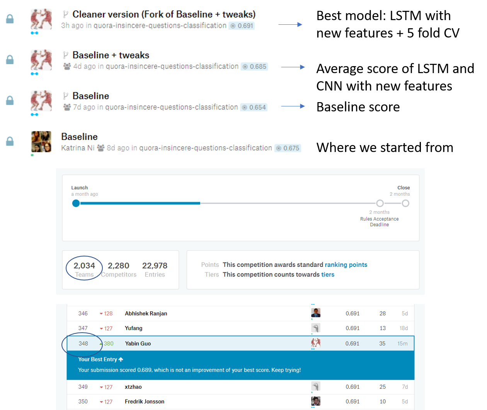

## This project is our final project for natural language processing course (CMPT 825)
## This project is a currently running Kaggle competition: [Quora Insincere Questions Classfication](https://www.kaggle.com/c/quora-insincere-questions-classification)
This is a kernel only competition. Our write up documentation includes the work of five persons. We tried our best to make every single cell runnable. We include a python jupyter notebook `best_submission.ipynb` in this repo. If you really want to try it, You can simply start a kaggle kernel and upload the notebook and commit the kernel.

  

## **Here is how we divided our work**, according to the pipeline shown above. Please see the work in detail in `project.ipynb`: 
- khlok: EDA, Topic Modelling
- tianpeis: EDA, Topic Modelling
- katrinan: starter Kaggle kernel, FastAI-ULMFit  
- yabing: Feature Engineering and incorporate the new features into LSTM, GRU
- junbob: Ensemble
- Each one of us experimented various DNN models including LSTM, GRU, CapsNet, CNN

As shown in the figure above, **we ended up at top 17% in Kaggle public Leaderboard**.