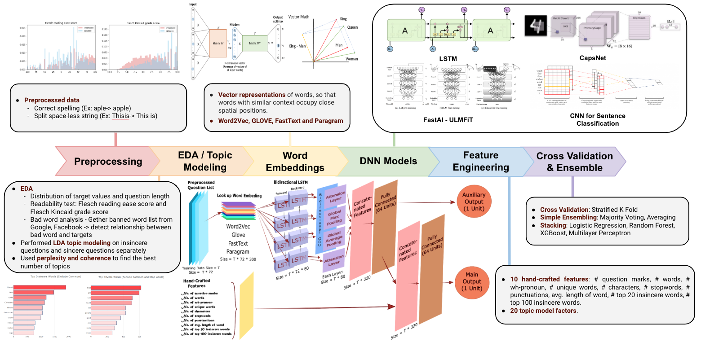

This project is a currently running Kaggle competition: [Quora Insincere Questions Classfication](https://www.kaggle.com/c/quora-insincere-questions-classification)

  

Here is how we divided our work, according to the pipeline shown above. Please see the work in detail in project.ipynb: 
- junbob: Ensemble
- yabing: Feature Engineering and Intergration
- khlok: EDA, Topic Modelling
- katrinan: FastAI
- tianpeis: EDA, Topic Modelling  
- Each one of us experimented various DNN models including LSTM, GRU, CapsNet, CNN

As shown in the figure above, we ended up at top 15% in Kaggle Leaderboard.